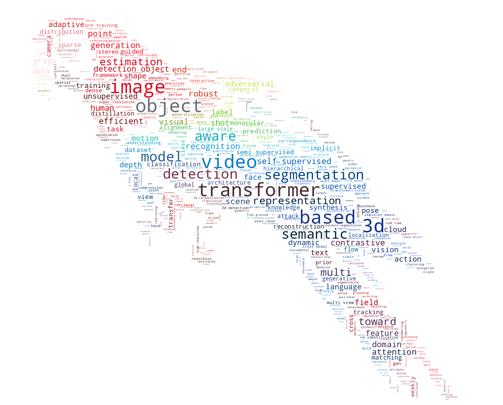
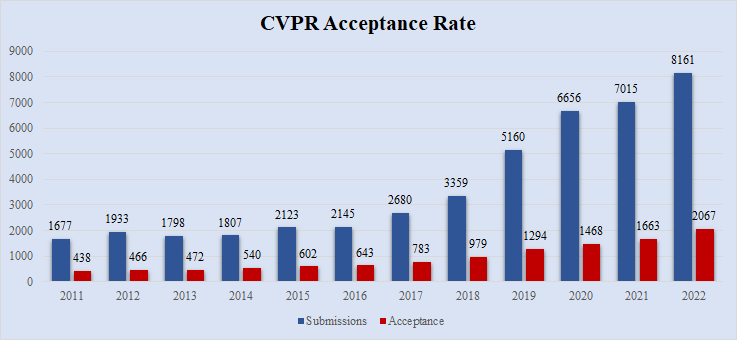
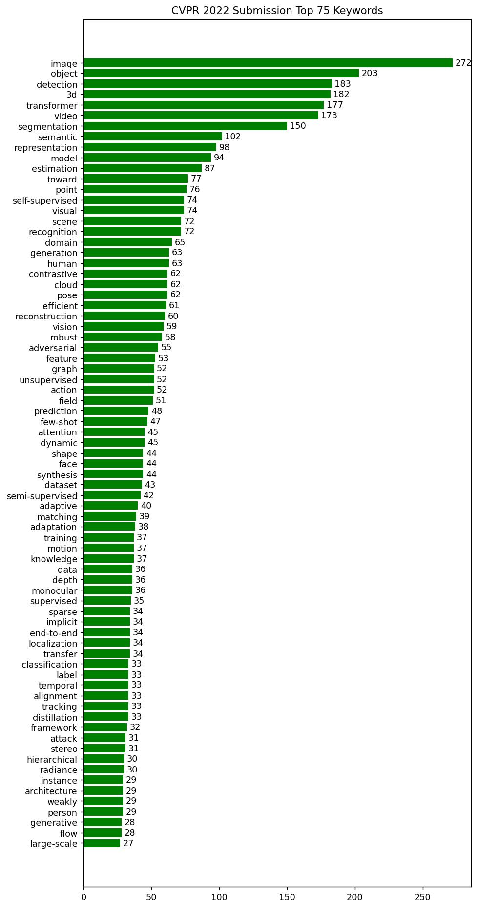
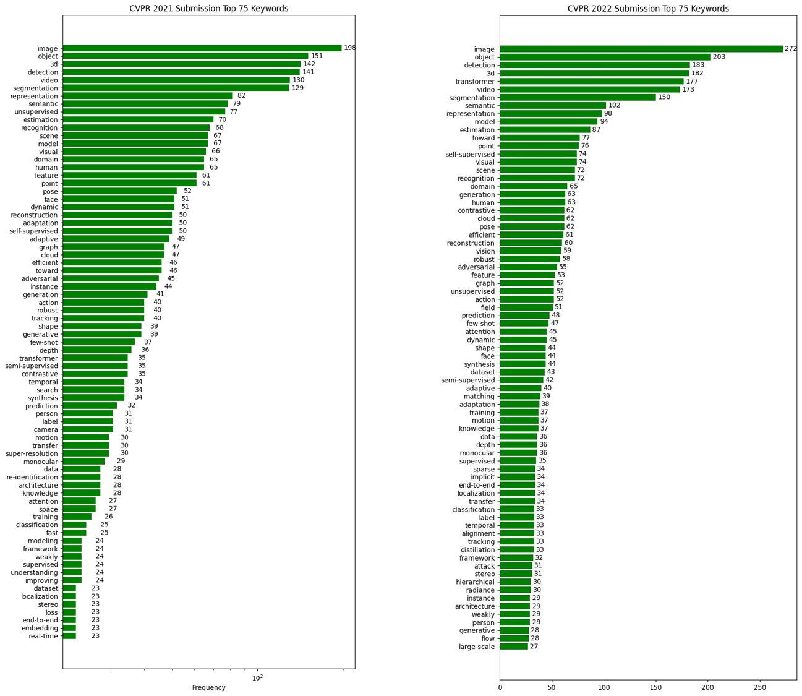

- [CVPR2022-Paper-Statistics](#cvpr2022-paper-statistics)
    - [Wordcloud](#wordcloud)
    - [Acceptance](#acceptance)
    - [Keyworks](#keyworks)
    - [Code Uasge](#code-uasge)
# CVPR2022-Paper-Statistics

Statistics and Visualization of main keyword of accepted papers for The IEEE / CVF Computer Vision and Pattern Recognition Conference ([CVPR 2022](https://cvpr2022.thecvf.com/))

Inspired by [CVPR-2021-Paper-Statistics](https://github.com/hoya012/CVPR-2021-Paper-Statistics/)


##  Wordcloud




##  Acceptance

| Year  | Submissions | Acceptance | Acceptance rate |
| :---: | :---------: | :--------: | :-------------: |
| 2011  |    1677     |    438     |     26.10%      |
| 2012  |    1933     |    466     |     24.10%      |
| 2013  |    1798     |    472     |     26.20%      |
| 2014  |    1807     |    540     |     29.90%      |
| 2015  |    2123     |    602     |     28.40%      |
| 2016  |    2145     |    643     |     29.90%      |
| 2017  |    2680     |    783     |     29.20%      |
| 2018  |    3359     |    979     |     29.10%      |
| 2019  |    5160     |    1294    |     25.07%      |
| 2020  |    6656     |    1468    |     22.13%      |
| 2021  |    7015     |    1663    |     23.71%      |
| 2022  |    8161     |    2067    |     25.32%      |



## Keyworks



- Most of the top keywords were maintained
    - Image, Object, Detection, 3D, Video, Segmentation 
- **Transfomer** are about $5\times$ as frequent, thanks for [**ViT**](https://arxiv.org/abs/2010.11929)
    - transfomer: $35$ -> $177$ 😉





## Code Uasge

```bash
# 1. install packages
pip install matplotlib scipy pillow wordcloud nltk numpy
# 2. run script
python cvpr22.py --list misc/CVPR2022-papers.list 
```